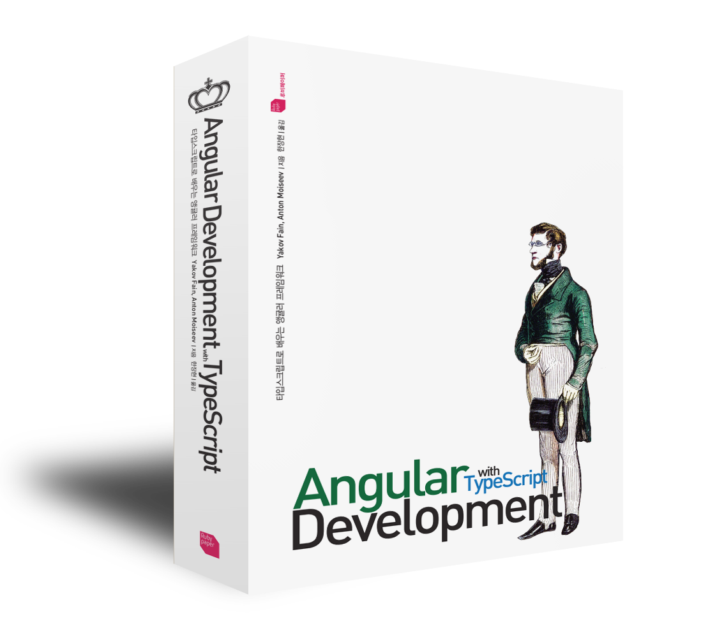

# Angular Development with TypeScript

책에서 다루는 예제 코드 저장소입니다.

## 구입처
- [인터넷 교보문고](http://www.kyobobook.co.kr/product/detailViewKor.laf?ejkGb=KOR&mallGb=KOR&barcode=9791186710159&orderClick=LEA&Kc=)
- [알라딘](http://www.aladin.co.kr/shop/wproduct.aspx?ItemId=110998774)
- [예스24](http://www.yes24.com/24/goods/42474040?scode=032&OzSrank=5)
- [인터파크 도서](http://book.interpark.com/product/BookDisplay.do?_method=detail&sc.shopNo=0000400000&sc.prdNo=268004646&sc.saNo=003002001&bid1=search&bid2=product&bid3=title&bid4=001)
- [반디앤루니스](http://www.bandinlunis.com/front/product/detailProduct.do?prodId=4076746)
- [영풍문고](http://www.ypbooks.co.kr/book.yp?bookcd=100783703)

## 기준 버전
- @angular : 4.1.0
- @angular/cli : 1.0.3
- TypeScript : 2.3.3
- yarn : 0.24.5

## 오류 수정
페이지 | 줄 | 원문 | 수정
--- | --- | --- | ---
6 | 17 | Node Package Manager(mpm) | Node Package Manager(npm)
36 | 12 | TypeScript로 작성하는 Hello~~w~~ World | TypeScript로 작성하는 Hello World
37 | 16 | `<<!DOCTYPE html>` | `<!DOCTYPE html>`
66 | 14 | System.import('./es6module.js'); // GET /es6Module.js | System.import('./es6module.js'); // GET /es6module.js
85 | 10 | `yarn add -D bootstrap` | `yarn add bootstrap`
85 | 11 | `yarn add -D jquery` | `yarn add jquery`
85 | 12 | 1: Bootstrap을 설치한다. ~~-D 옵션을 붙이면 패키지를 설치하면서 package.json의 devDependencies 항목에 해당 패키지를 추가한다.~~ | 1 : Bootstsrap을 설치한다.
99 | 9 | count~~er~~ 프로퍼티는 | count 프로퍼티는
99 | 9 | stars 배열에 들어있는 항목이 false면 별을 색칠하지 않고, true면 별을 색칠한다. | stars 배열에 들어있는 항목이 false면 별을 색칠하고, true면 별을 색칠하지 않는다. (내용 반대)
129 | 12 | template : '...', | template : \`...\`,
185 | 16 | emitDecoratorMetaData | emitDecoratorMetadata
187 | 4 | providers는 프로바이더를 등록하는 어노테이션 프로퍼티고, provide~~r~~는 개별 프로바이더에 사용하는 프로퍼티다. | providers는 프로바이더를 등록하는 어노테이션 프로퍼티고, provide는 개별 프로바이더에 사용하는 프로퍼티다.
190 | 15 | `import { NgModule } from '@angular/core';` | (삭제)
191 | 12 | `import { Component, bind } from '@angular/core';`  | `import { Component } from '@angular/core';`
197 | 13 | 코드 4.4 main.ts | 코드 4.4 main-change-provider.ts
212 | 20 | providers 프로퍼티를 viewProviders~~를~~ | providers 프로퍼티를 viewProviders로
266 | 15 | uppsercase와 같이 | uppercase와 같이
275 | 13 | `import { FilterPipe } from '../pipes/filter.pipe' ···➊` | (삭제)
275 | 17 | `styleUrl : 'app/components/home/home.component.css',` | `styleUrls : ['app/components/home/home.component.css'],`
296 | 10 | 어느 날에는 집을 조립하고 하고, | 어느 날에는 집을 조립하고,
316 | 13 | 코드 6.10 ng-onchanges-with-param.ts | 코드 6.10 on-changes-with-param.ts
377 | 11 | }, ~~{},~~ equalValidator) | }, equalValidator)
404 | 11 | 이 폴더에 hello_server. | 이 폴더에 hello-server.
405 | 1 | 코드 8.1 hello_server.ts | 코드 8.1 hello-server.ts
406 | 8 | 이 방식에서는 hello_server.ts 파일의 | 이 방식에서는 hello-server.ts 파일의
406 | 21 | 이제 yarn tsc 명령을 실행하면 hello_server.js 파일이 | 이제 yarn tsc 명령을 실행하면 hello-server.js 파일이
407 | 7 | `node build/hello_server.js` | `node build/hello-server.js`
407 | 8 | V8 JavaScript 엔진을 시작하고 hello_server.js | V8 JavaScript 엔진을 시작하고 hello-server.js
419 | 22 | ~~"@types/es6-shim": "^0.31.33",~~ | (삭제)
440 | 1 | `res.sendFile(path.join(__dirname, '..', 'client/simple-websocket-client.html'));` | `res.sendFile(path.resolve(__dirname, '..', 'client/simple-websocket-client.html'));`
489 | 9 | 다음 코드는 라우터 설정에 /product 주소가 | 다음 코드는 라우터 설정에 /products 주소가
489 | 10 | 페이지가 /product/0으로 | 페이지가 /products/0으로
489 | 17 | `expect(location.path()).toBe('/product/0');` | expect(location.path()).toBe('/products/0');
500 | 23 | `TestBed.createComponent(AppComponent);` | `TestBed.createComponent(AppComponent);` ... ⑥
500 | 25 | `tick();` ...⑥ | `tick();` ...⑦
500 | 29 | `it('should be able to navigate to weather using commands API',` ...⑦ | `it('should be able to navigate to weather using commands API',` ...⑧
501 | 6 | `it('should be able to navigate to weather by URL',` ...⑧ | `it('should be able to navigate to weather by URL',` ...⑨
504 | 20 | hasResult() 함수와 | _hasResult() 함수와
510 | 10 | 코드 9.9 weather.spec.ts | 코드 9.9 weather.component.spec.ts
518 | 9 | 파일 경로가 /app으로 시작하는 styleUrl | 파일 경로가 /app으로 시작하는 styleUrls
551 | 2 | @Component 어노테이션의 templateUrl 항목과 styleUrl | @Component 어노테이션의 templateUrl 항목과 styleUrls
559 | 8줄 다음 | (추가) | `import '@angular/platform-browser`;
570 | 9 | ~~const ContextReplacementPlugin = require('webpack/lib/ContextReplacementPlugin');~~ | (삭제)
596 | 9 | styleUrl은 styles로, | styleUrls는 styles로
653 | 16 | `let { sym, price, stockExchange } = getStock();` | `let { symbol : sym, price, stockExchange } = getStock();`
653 | 17 | `console.log(`The price of ${symbol} is ${price} ${stockExchange}`);` | `console.log(`The price of ${sym} is ${price} ${stockExchange}`);`
657 | 12 | forEach() 함수를 사용해서 배열의 항목~~은~~ | forEach() 함수를 사용해서 배열의 항목**을**

## 목차
- Chapter 01 Angular 소개
    - 1.1 JavaScript 프레임워크와 라이브러리
        - 1.1.1 종합 프레임워크
        - 1.1.2 경량 프레임워크
        - 1.1.3 라이브러리 
        - 1.1.4 Node.js는 무엇인가?
    - 1.2 AngularJS 살펴보기
    - 1.3 Angular 살펴보기
        - 1.3.1 단순해진 코드
        - 1.3.2 성능 향상
    - 1.4 Angular 개발자가 사용하는 툴
    - 1.5 Angular 기능 구현 방식
    - 1.6 온라인 경매 애플리케이션 예제
    - 1.7 정리
  
- Chapter 02 Angular 시작하기
    - 2.1 첫 번째 Angular 애플리케이션
        - 2.1.1 TypeScript로 작성하는 Hellow World
        - 2.1.2 ES5로 작성하는 Hello World
        - 2.1.3 ES6로 작성하는 Hello World
        - 2.1.4 애플리케이션 실행하기
    - 2.2 Angular 애플리케이션의 구성 요소
        - 2.2.1 모듈(Module)
        - 2.2.2 컴포넌트(Component)
        - 2.2.3 디렉티브(Directive)
        - 2.2.4 데이터 바인딩 기초
    - 2.3 SystemJS 모듈 로더
        - 2.3.1 모듈 로더
        - 2.3.2 모듈 로더 vs. <script> 태그
        - 2.3.3 SystemJS 시작하기
    - 2.4 패키지 매니저 선택하기
        - 2.4.1 npm과 jspm 비교
        - 2.4.2 npm vs. yarn
        - 2.4.3 yarn으로 Angular 프로젝트 시작하기
    - 2.5 실습 : 온라인 경매 애플리케이션
        - 2.5.1 프로젝트 설정
        - 2.5.2 첫 페이지 구성하기
        - 2.5.3 온라인 경매 애플리케이션 실행하기
    - 2.6 정리

- Chapter 03 라우터로 내비게이션 구현하기
    - 3.1 라우터
        - 3.1.1 위치 정책(Location strategy)
        - 3.1.2 라우터 구성 요소
        - 3.1.3 navigate( ) 함수 사용하기
    - 3.2 라우터로 데이터 전달하기
        - 3.2.1 ActivatedRoute에서 라우팅 인자 추출하기
        - 3.2.2 라우터로 정적 데이터 전달하기
    - 3.3 자식 라우팅
    - 3.4 라우팅 가드(Route Guards)
    - 3.5 라우팅 영역 여러 개 만들기
    - 3.6 모듈 단위로 앱 나누기
    - 3.7 모듈 지연 로딩
    - 3.8 실습 : 내비게이션 추가하기
        - 3.8.1 ProductDetailComponent 만들기
        - 3.8.2 HomeComponent 만들기
        - 3.8.3 ApplicationComponent 정리하기
        - 3.8.4 ProductComponent에 RouterLink 추가하기
        - 3.8.5 루트 모듈에 라우팅 추가하기
        - 3.8.6 애플리케이션 실행하기
    - 3.9 정리

- Chapter 04 의존성 주입
    - 4.1 의존성 주입과 제어권 역전
        - 4.1.1 의존성 주입 패턴
        - 4.1.2 제어권 역전 패턴
        - 4.1.3 의존성 주입의 장점
    - 4.2 인젝터와 프로바이더
        - 4.2.1 프로바이더 등록하기
    - 4.3 의존성 주입 예제
        - 4.3.1 상품 서비스 주입하기
        - 4.3.2 HTTP 서비스 주입하기
    - 4.4 프로바이더 변경하기
        - 4.4.1 프로바이더에 useFactory와 useValue 사용하기
        - 4.4.2 불투명 토큰(OpaqueToken) 사용하기
    - 4.5 인젝터의 계층 구조
        - 4.5.1 viewProviders
    - 4.6 실습 : 의존성 주입 패턴 확인하기
        - 4.6.1 라우터 인자를 상품의 ID로 수정하기
        - 4.6.2  ProductDetailComponent 수정하기
    - 4.7 정리

- Chapter 05 바인딩, 옵저버블, 파이프
    - 5.1 데이터 바인딩
        - 5.1.1 이벤트 바인딩
        - 5.1.2 프로퍼티 바인딩, 어트리뷰트 바인딩
        - 5.1.3 템플릿 바인딩
        - 5.1.4 양방향 데이터 바인딩
    - 5.2 반응형 프로그래밍과 옵저버블
        - 5.2.1 옵저버와 옵저버블이 무엇인가?
        - 5.2.2 옵저버블 이벤트 스트림
        - 5.2.3 옵저버블 취소하기
    - 5.3 파이프
        - 5.3.1 커스텀 파이프
    - 5.4 실습 : 상품 필터링
        - 5.4.1 프로젝트에 FormModule 추가하기
        - 5.4.2 커스텀 파이프 정의하기
        - 5.4.3 SearchComponent 수정하기
        - 5.4.4 HomeComponent 수정하기
        - 5.4.5 AppModule 수정하기
        - 5.4.6 경매 애플리케이션 실행하기
    - 5.5 정리

- Chapter 06 컴포넌트 통신
	- 6.1 컴포넌트끼리 통신하기
		- 6.1.1 입력 프로퍼티와 출력 프로퍼티
		- 6.1.2 중개자 패턴
		- 6.1.3 프로젝션
	- 6.2 컴포넌트 생명주기
		- 6.2.1 ngOnChanges( ) 함수 사용하기
	- 6.3 변화 감지기 동작 원리
	- 6.4 자식 컴포넌트의 API 직접 실행하기
	- 6.5 실습 : 별점 기능 추가하기
		- 6.5.1 StarsComponent 클래스 코드 수정하기
		- 6.5.2 StarsComponent 템플릿 수정하기
		- 6.5.3 ProductDetailComponent 템플릿 수정하기
		- 6.5.4 ProductDetailComponent 클래스 코드 수정하기
		- 6.5.5 AppModule 수정하기
	- 6.6 정리

- Chapter 07 폼 처리하기
	- 7.1 HTML 폼
		- 7.1.1 HTML 표준 폼
		- 7.1.2 Angular 폼
	- 7.2 템플릿 기반 폼
		- 7.2.1 템플릿 기반 폼에 사용하는 디렉티브
		- 7.2.2 HTML 폼에 적용하기
	- 7.3 반응형 폼
		- 7.3.1 폼 모델
		- 7.3.2 폼 디렉티브
		- 7.3.3 예제 폼 리팩토링
		- 7.3.4 FormBuilder 사용하기
	- 7.4 폼 유효성 검사
		- 7.4.1 반응형 폼 유효성 검사
	- 7.5 실습 : 검색 폼에 유효성 검사 추가하기
		- 7.5.1 SearchComponent에 카테고리 목록 추가하기
		- 7.5.2 폼 모델 만들기
		- 7.5.3 템플릿 수정하기
		- 7.5.4 onSearch( ) 함수 구현하기
		- 7.5.5 애플리케이션 실행하기
	- 7.6 정리

- Chapter08 서버와 데이터 주고받기
	- 8.1 Http 객체
	- 8.2 Node.js와 TypeScript로 웹 서버 만들기
		- 8.2.1 간단한 웹 서버 만들기
		- 8.2.2 JSON 데이터 제공하기
		- 8.2.3 TypeScript로 실시간 변환하고 로드하기
		- 8.2.4 상품 정보를 제공하는 RESTful API 추가하기
	- 8.3 Angular와 Node.js 연동하기
		- 8.3.1 정적 리소스(Static resources) 제공하기
		- 8.3.2 클라이언트 환경 설정
		- 8.3.3 HTTP GET 요청하기
		- 8.3.4 AsyncPipe 
		- 8.3.5 서비스에 HTTP 주입하기
	- 8.4 웹소켓 사용하기
		- 8.4.1 Node.js 서버에서 데이터 푸시하기
		- 8.4.2 웹소켓을 옵저버블로 만들기
	- 8.5 실습 : 상품 검색과 입찰 알림 구현하기
		- 8.5.1 HTTP 서버 구현하기
		- 8.5.2 상품 검색 기능 구현하기
		- 8.5.3 웹소켓으로 입찰 알림 보내기
	- 8.6 정리

- Chapter09 유닛 테스트
	- 9.1 Jasmine 프레임워크
		- 9.1.1 무엇을 테스트할 것인가
		- 9.1.2 Jasmine 설치하기
	- 9.2 Angular 테스트 라이브러리
		- 9.2.1 서비스 테스트
		- 9.2.2 라우터 테스트
		- 9.2.3 컴포넌트 테스트
	- 9.3 날씨 애플리케이션 테스트
		- 9.3.1 프로젝트 설정
		- 9.3.2 라우터 테스트
		- 9.3.3 서비스 테스트
		- 9.3.4 컴포넌트 테스트
	- 9.4 Karma 테스트 러너 실행하기
	- 9.5 실습 : 유닛 테스트 적용하기
		- 9.5.1 ApplicationComponent 테스트 코드
		- 9.5.2 ProductService 테스트 코드
		- 9.5.3 StarsComponent 테스트 코드
		- 9.5.4 테스트 실행
	- 9.6 정리
	
- Chapter10 번들링, 배포
	- 10.1 Webpack 살펴보기
		- 10.1.1 Webpack 시작하기
		- 10.1.2 Webpack 로더
		- 10.1.3 Webpack 플러그인
	- 10.2 Webpack 기본 설정
		- 10.2.1 yarn build
		- 10.2.2 yarn start
	- 10.3 개발용 설정과 운영용 설정 분리하기
		- 10.3.1 package.json 설정
		- 10.3.2 환경변수 설정
		- 10.3.3 Webpack 설정
		- 10.3.4 Angular 애플리케이션에 Node.js 환경 변수 전달하기
		- 10.3.5 실행하기
	- 10.4 Angular CLI
		- 10.4.1 Angular CLI로 프로젝트 생성하기
		- 10.4.2 Angular CLI 커맨드
	- 10.5 실습 1 : Webpack 적용하기
		- 10.5.1 서버 수정하기
		- 10.5.2 클라이언트 수정하기
		- 10.5.3 Karma 테스트 설정하기
		- 10.5.4 운영용으로 빌드하고 배포하기
	- 10.6 실습 2 : Angular CLI로 리팩토링하기
		- 10.6.1 프로젝트 생성하기
		- 10.6.2 컴포넌트 생성하기
		- 10.6.3 라우터 연결하기
		- 10.6.4 서비스 생성하기
		- 10.6.5 서드 파티 라이브러리 사용하기
		- 10.6.6 테스트 스펙 수정하기
		- 10.6.7 빌드, 배포하기
	- 10.7 정리

- appendix A ECMAScript 6
	- A.1 예제 코드 실행하기
	- A.2 템플릿 리터럴
	- A.3 옵션 인자와 인자 기본값
	- A.4 변수 스코프
	- A.5 화살표 함수 표현식과 this
	- A.6 forEach( ), for-in, for-of
	- A.7 클래스와 상속
	- A.8 프로미스로 비동기 작업 처리하기
	- A.9 모듈

- appendix B TypeScript
	- B.1 Angular 애플리케이션은 왜 TypeScript로 작성할까?
	- B.2 트랜스파일러의 역할
	- B.3 TypeScript 시작하기
		- B.3.1 TypeScript 설치하고 실행하기
	- B.4 JavaScript의 상위 집합
	- B.5 타입 지정
		- B.5.1 함수
		- B.5.2 인자 기본값
		- B.5.3 옵션 인자
		- B.5.4 화살표 함수 표현식
	- B.6 클래스
		- B.6.1 접근 제한자
		- B.6.2 메소드
		- B.6.3 상속
	- B.7 제네릭(Generics)
	- B.8 인터페이스(Interfaces)
		- B.8.1 커스텀 타입으로 사용하기
		- B.8.2 추상 클래스로 사용하기
		- B.8.3 실행할 수 있는 인터페이스
	- B.9 클래스 메타데이터 추가하기, 어노테이션
	- B.10 타입 정의 파일
	- B.11 TypeScript & Angular 개발 단계 훑어보기